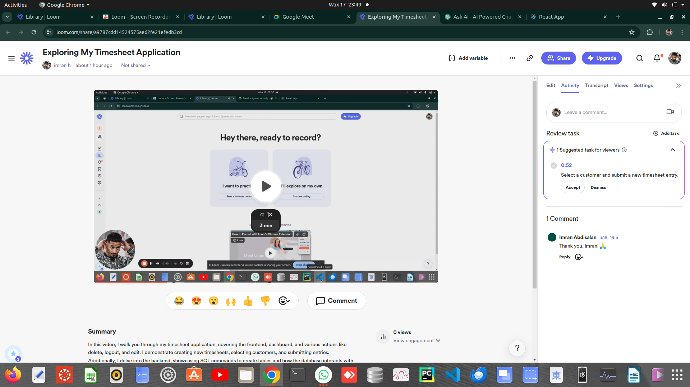
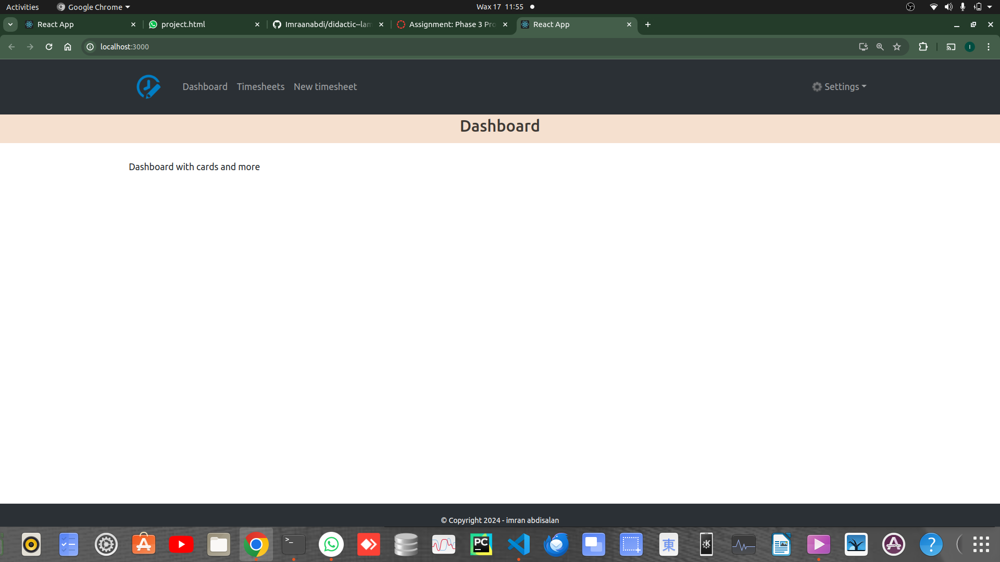
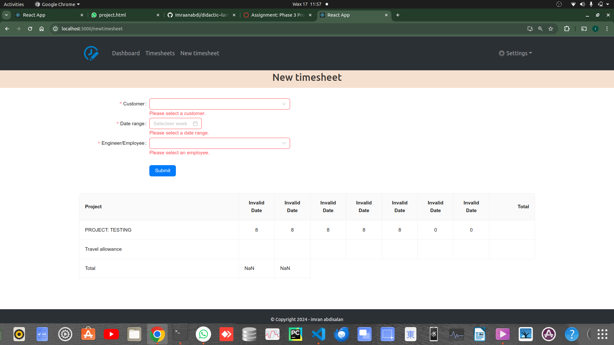
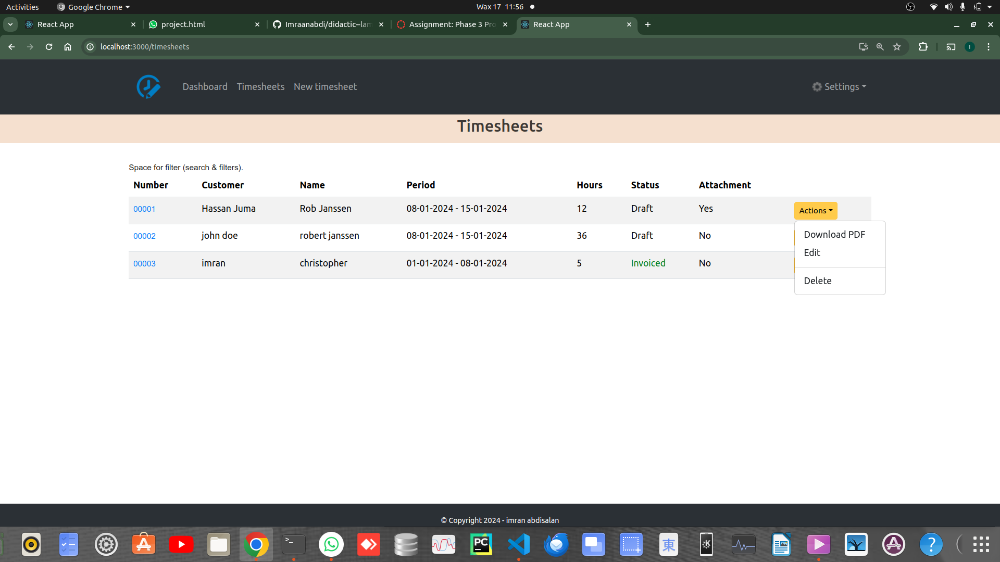

 

  
  

[text](https://www.loom.com/share/a9787cdd14524575ae62fe21efedb3cd)

# PROJECT IMAGES :
Summary
In this video, I walk you through my timesheet application, covering the frontend, dashboard, and various actions like delete, logout, and edit. I demonstrate creating new timesheets, selecting customers, and submitting entries. Additionally, I delve into the backend, showcasing SQL commands to create tables and how the database interacts with the front-end. Watch to understand the full application flow!
Chapters
Generated by Loom AI
0:00
Frontend Overview
0:47
Actions and Timesheet Creation
1:42
Database Setup and Tables

   <!-- for better view click image to enlarge >>..>>
 
  
  
  
  
  
  
   
  [https://drive.google.com/drive/home] -->